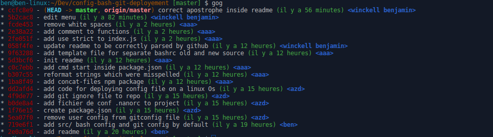

# config-bash-git-deployement

### Table of Contents
- **[Requirement](#requirement)**
- **[Introduction](#introduction)**
- **[Files tree](#files-tree)**
- **[Installation](#installation)**
- **[Deployement :](#deployement)**
 - **[First step](#first-step)**
 - **[Second step](#second-step)**
 - **[Third step](#third-step)**
 - **[Fourth step](#fourth-step)**
- **[API documentation](#api-documentation)**
- **[Acknowledgement](#acknowledgement)**


## **Requirement**

*You must have installed NODEJS* :
 - [use NVM](https://github.com/creationix/nvm#install-script)

*ONLY tested on linux os*

## **Files tree**
```
   .
    ├── .gitignore
    ├── index.js                    // file used for deployement
    ├── package.json                // list packages used by index.js
    ├── README.md
    └── src
        ├── .bashrc                 // master file called by every bash instance, it contain's import of others files
        ├── .bashrc.d               // directory for bash other scripts
        │   ├── bashrc_aliases      // bash alias contain's persistent alias
        │   └── bashrc_prompt       // contain's syntax coloration for terminal
        ├── .gitconfig              // git main config file with every git alias, set up for accounts etc...
        ├── .git.d                  // directory for git other scripts
        │   └── .git-completion.bash // allow git cmd completion
        └── .nanorc                 // custom nano settings

```
## **Introduction**
this repository is usefull to deploy a basic configuration for git and bash terminal.

It will duplicate files from inside `src/` and apply them on the user home `~/`.
You will have to provide a git user name and a email adress for the git configuration.

This repository will provide you with alias and git autocompletions and terminal coloration if you are in a git repository :


## **Installation**
Just run the cmd bellow to init the project.

```bash
    $ npm install

```
## **Deployement**
Now let just start import of this new configuration inside our `home`.

```bash
    $ npm run start
```

#### *First step*:
It will ask you to provide a name for git to be able to commit.

```bash
# Merci de remplir votre nom d'utilisateur git: <votre réponse ici>
```

#### *Second step*:
It ask for your email now.

```bash
# merci de remplir votre email : <votre email ici>
```

#### *Third step*:
We save the original `.bashrc` and `.gitconfig` under those names :

```bash
# création dun backup de /home/ben/.bashrc ------------> /home/ben/.bashrc.before.config.deployement.backup

# création d'un backup de /home/ben/.gitconfig ------------> /home/ben/.gitconfig.before.config.deployement.backup
```

#### *Fourth step*:
We merge your `.bashrc` backup and our new `.bashrc` config and we add a split between.

```bash

#OLD/YOUR CONFIG END <--------------------------------------------------
#
#
#
#-----------------------------------------------------> NEW CONFIG START

```
## API documentation

To see every Alias available on the bash terminal just write inside a terminal this cmd:

```bash
$ alias
```

### .bashrc_aliases
It contain every alias which will be avaible on bash terminals.
And the most important alias is the one to edit every aliases via `nano` and reload bash source after edition.

Call this cmd inside a terminal:
```bash
$ EditAlias
```
It will also give your access to those alias :
```bash
#Git alias
alias gis='git status'
alias gap='git add -p'
alias gic='git commit -m'
alias gpush='git push origin '

# will show you a log with commmits and branches see exemple below

alias gog="git log --pretty=tformat:'%Cred%h%Creset -%C(auto)%d%Creset %s %Cgreen(%cr) %C(bold blue)<%an>%Creset' --branches --graph"

```

`gog` alias return inside git repository :



## Acknowledgement

thanks to [Maxime Bréhin](https://twitter.com/mbrehin) from [Delicious insights](http://delicious-insights.com/) for the perfect git formation which cover everything i needed to know about git!
And for the knowledge provided on scripting.

thanks to [Companeo](http://www.companeo.com/) for sending me to Delicious insights git formation.
